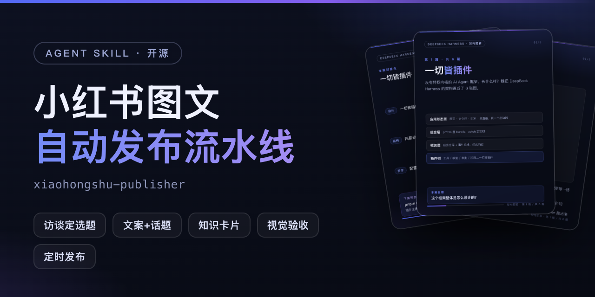
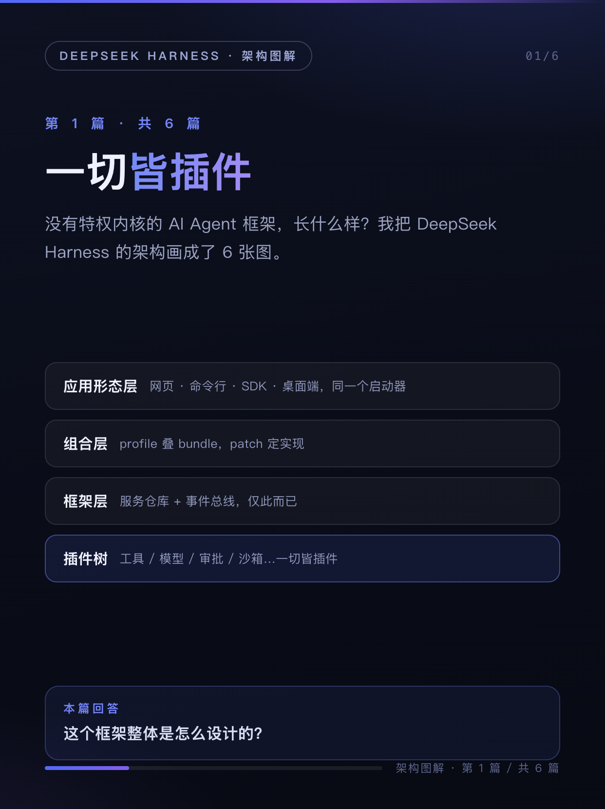
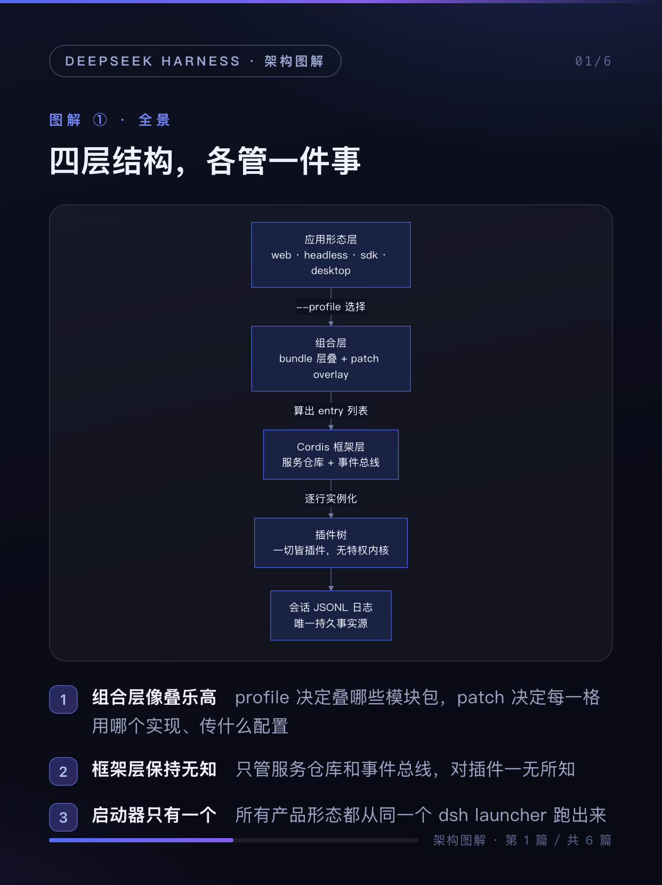
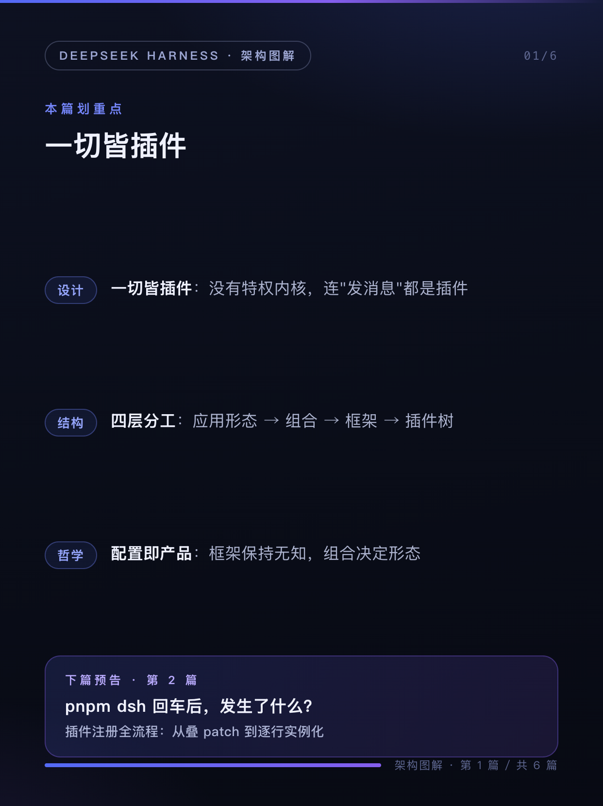
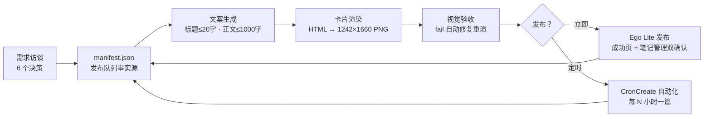

<div align="center">



# xiaohongshu-publisher

**把任何主题变成小红书图文系列，并自动发布 —— 一个开箱即用的 AI Agent Skill**

*Turn any topic into a Xiaohongshu (RED) post series with auto-publishing — an open-source Agent Skill.*

[](LICENSE)
[](#-安装)
[](https://github.com/mahingbun-dev/xiaohongshu-publisher)
[](#-参与贡献)

</div>

---

你只需要给一个主题（或者一份文档、一门手艺、一个产品），这个 skill 会带你走完一整套已实战验证的流水线：

**需求访谈 → 系列选题 → 标题/正文/话题文案 → 3:4 知识卡片配图 → 逐张视觉验收 → 通过浏览器真实发布 → 定时自动化队列**

不需要任何小红书开放 API（也不存在面向个人的 API）——发布环节由 [Ego Lite](https://www.ego-browser.xyz/) 浏览器以你**已登录的真实账号**完成，自动化队列按你定的节奏（如每 3 小时一篇）逐篇发布。

## 🖼 真实产出

下面是一套由本 skill 制作并发布到小红书的 6 篇技术系列（DeepSeek Harness 架构图解）中的 3 张卡片，1242×1660（3:4），渲染文字 100% 准确：

| 封面 | 架构图解 | 划重点 + 预告 |
| --- | --- | --- |
|  |  |  |

## ✨ 特性

- **💬 访谈式定选题** — 内置 6 个关键决策（篇数、配图形式、口吻、审核级别、首篇时机、每篇张数），每个都带实战验证过的默认推荐，两轮提问即可开工
- **📝 平台合规文案** — 标题 ≤20 字、正文 ≤1000 字硬校验，话题标签、系列序号、下篇预告钩子一体成型
- **🎨 数据驱动的知识卡片** — 一个 JSON 描述全部内容，内置 3 套风格预设（深色科技 / 米白简约 / 暖色生活），Mermaid 架构图自动渲染并等比缩放，产出 1242×1660 高清 PNG
- **👀 视觉验收闭环** — 每张卡经过独立的视觉评审（截断 / 溢出 / 孤字 / 空版面 / 风格一致性），fail 自动修复重渲，直到全过
- **🚀 真实账号发布** — 浏览器自动化走网页端创作平台，发布成功以「跳转成功页 + 笔记管理列表核对」双重确认
- **⏰ 定时自动化队列** — manifest 驱动的发布队列：失败保持待发下轮重试、防跳篇、登录态过期自动交还控制权
- **🧯 踩坑全记录** — 同名页签歧义、话题下拉遮挡发布按钮、截图 DPI 陷阱……全部写进发布配方文档

## 🚀 安装

```sh
git clone https://github.com/mahingbun-dev/xiaohongshu-publisher.git
mkdir -p ~/.agents/skills
cp -r publisher ~/.agents/skills/xiaohongshu-publisher
```

**环境要求**：

| 依赖 | 用途 | 必需？ |
| --- | --- | --- |
| [ZCode](https://zcode.ai)（或任何支持 Agent Skills 的宿主） | 运行 skill | ✅ |
| [Ego Lite](https://www.ego-browser.xyz/) 浏览器 + `ego-browser` CLI | 真实发布、卡片截图 | 发布/渲染必需 |
| 在 Ego Lite 中登录小红书 | 发布账号 | 发布必需 |
| Node ≥ 18 | 卡片生成脚本 | 渲染必需 |
| [mmx CLI](https://github.com/AIDotNet/mmx)（MiniMax） | AI 插画路线（可选） | ❌ |

> 不想装 Ego Lite？skill 的访谈、文案、卡片生成部分照常可用，发布环节换成手动上传即可。

## 💬 使用

装好后，对 agent 说人话即可触发：

```text
把 docs/testing.md 做成小红书 4 篇图文系列，只要素材不发布
帮我策划一个「新手咖啡冲煮」系列，5 篇，每 3 小时发一篇
用 warm-life 风格给我的咖啡馆写 3 篇探店笔记
```

或者显式调用：`/xiaohongshu-publisher <你的需求>`

## 🏗 工作原理



三个核心设计：

1. **`manifest.json` 是唯一事实源** — 每篇的标题、正文（含话题）、图片路径、发布状态全在一个文件里，自动化每轮读它取「第一篇 pending」，发完写回。
2. **卡片 = 数据文件，不是手工修图** — 内容写在 `cards-data.json`，HTML 模板渲染，Ego 浏览器以 2× 设备像素比截图。改内容 = 改 JSON 重跑两个命令。
3. **发布脚本自带安全栏** — 发布前校验标题/正文长度与图片存在性；发布中未登录自动交还浏览器控制权；任何失败保持 `pending` 并写入 `error` 字段，下一轮只重试同一篇。

## 🎨 三种卡片风格

| 预设 | 风格 | 适合 |
| --- | --- | --- |
| `tech-dark` | 深色科技，蓝紫渐变 | 编程、AI、互联网 |
| `paper-light` | 米白纸质，陶土+青碧 | 读书、美食、手帐 |
| `warm-life` | 奶油暖调，橙黄 | 探店、生活方式、育儿 |

所有颜色 token 都可在 `cards-data.json` 的 `style` 字段里逐项覆盖，改出你自己的品牌色。示例数据见 [`examples/foodie/cards-data.json`](examples/foodie/cards-data.json)。

## ⚠️ 使用须知

- **账号安全**：自动化使用你真实账号操作。请遵守小红书社区规范，控制发布频率，勿用于刷量、搬运或营销骚扰——由此产生的一切后果由使用者承担。
- **内容责任**：医疗、金融、投资类内容请先确认符合平台规范；skill 只加工你提供的素材，不替你核实事实。
- **网页端结构会变**：发布依赖创作平台 DOM。skill 已把踩坑经验沉淀为「手动配方」兜底，脚本失效时按 `references/publish-recipe.md` 交互式操作，也欢迎提 PR 更新配方。

## ❓ FAQ

<details>
<summary><b>会不会被小红书封号？</b></summary>

skill 走的是网页端创作平台的正常发布流程，与你手动发帖无异；自动化模板内置防跳篇与单轮单篇限制。但任何自动化都有风险，请自担频率与内容合规责任。
</details>

<details>
<summary><b>为什么不用官方 API？</b></summary>
小红书没有面向个人创作者的开放发布 API。浏览器自动化是目前唯一可靠路径，Ego Lite 的价值在于复用你已登录的真实会话。
</details>

<details>
<summary><b>支持 Claude Code / 其他 Agent 吗？</b></summary>
skill 采用标准的 Agent Skills 目录结构（SKILL.md + references + scripts）。只要宿主支持该结构（SKILL.md 头部的 YAML 元数据 + 按需加载 references）即可直接使用；发布/渲染脚本也可独立于 agent 手动执行。
</details>

<details>
<summary><b>卡片上的 Mermaid 图渲染失败？</b></summary>
模板从 jsdelivr/unpkg 双 CDN 加载 mermaid@11，离线环境需自行内联 mermaid 脚本，或改用 <code>visual</code> 字段手写 HTML 视觉块。
</details>

## 📁 仓库结构

```
xiaohongshu-publisher/
├── publisher/                 # skill 本体（拷进 ~/.agents/skills/ 即安装）
│   ├── SKILL.md               # 六阶段主流程
│   ├── references/
│   │   ├── publish-recipe.md  # 发布配方 + 故障速查
│   │   └── automation.md      # manifest schema + 自动化模板
│   └── scripts/
│       ├── build-cards.mjs    # 卡片生成器（数据驱动）
│       ├── render-cards.js    # Ego 浏览器 2x 截图
│       └── publish-note.mjs   # 单篇发布（含安全校验）
├── examples/foodie/           # 美食主题示例数据
└── docs/                      # banner 与真实案例图
```

## 🤝 参与贡献

欢迎 PR：新风格预设、新视觉组件、发布配方的平台适配更新、英文文档。改动请保持「发布脚本的失败安全栏」语义不变。

## 📄 License

[MIT](LICENSE) © mahingbun-dev

<div align="center">
<sub>如果这个 skill 帮你发出了第一篇爆款，欢迎点个 ⭐ 让更多人看到</sub>
</div>
